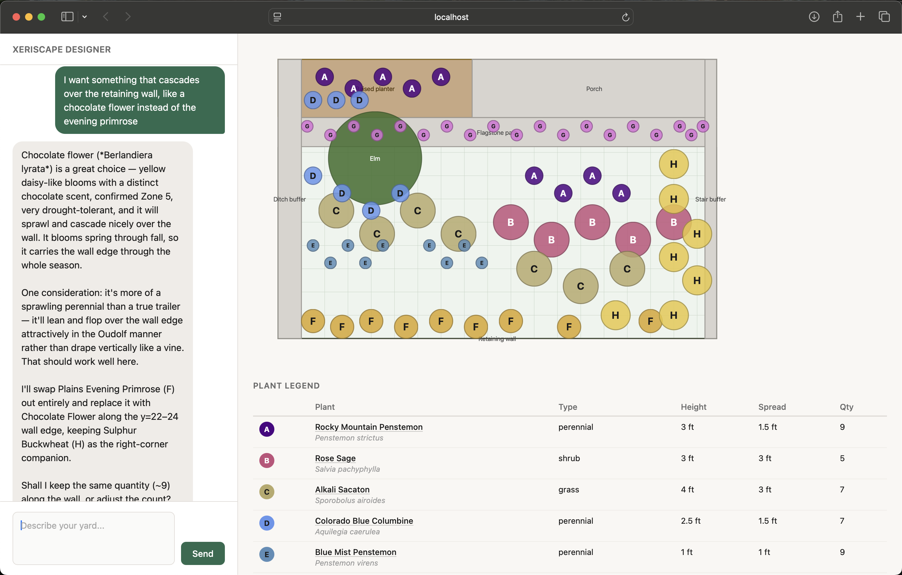

# Xeriscape Yard Designer

An AI-assisted web app for designing drought-tolerant yards. Describe your yard in natural language — Claude interprets the space, recommends xeriscape-appropriate plants, and renders a scaled SVG planting plan.



## What it does

1. Describe your yard conversationally — dimensions, existing trees, planters, paths, and any spatial relationships ("tree is 10'-6" from the planter")
2. Claude interprets the layout, confirms its reading, and asks focused clarifying questions
3. Claude recommends xeriscape-appropriate plants laid out in absolute coordinates
4. A scaled SVG diagram renders — yard boundary, existing features, plant positions, legend
5. Refine conversationally ("more purple", "fewer shrubs") — the diagram updates each turn

No form. Real yards are irregular; natural language is the only honest input model.

## Tech stack

| Layer | Technology |
|---|---|
| Frontend | Vite + React (TypeScript) |
| Backend | Rails API mode (Ruby) |
| AI | Claude API — spatial interpretation + plant recommendations |
| SVG rendering | Rails (`SvgRenderService`) — design JSON → SVG string |
| MCP server | TypeScript (`@modelcontextprotocol/sdk`) — Phase 2 |
| Database | PostgreSQL — Phase 3 |
| Hosting | Vercel (frontend), Render (API) |

## Architecture

See [`docs/ARCHITECTURE.md`](docs/ARCHITECTURE.md) for the full design and decisions.
See [`docs/API_ARCHITECTURE.md`](docs/API_ARCHITECTURE.md) for the API contract and request/response shape.

### On spatial interpretation

Claude serves two roles: spatial interpreter and plant recommender. When a user describes their yard, Claude converts natural language measurements (including feet-inches like `37'-8"`) and relational descriptions ("10 ft from the planter") into an absolute coordinate model — `(0,0)` at top-left, x right, y down, decimal feet. It confirms its reading before producing a design.

Research into existing MCP servers and GIS APIs (Mapbox, ArcGIS, Grasshopper 3D) found that all assume geographic coordinates anchored to the real world — none handle arbitrary local spaces like a yard. Claude's native spatial reasoning, guided by a tight prompt, is the right approach.

### On the MCP server

The MCP server (Phase 2) grounds Claude's recommendations in structured domain data rather than relying solely on training knowledge. This pattern is most valuable when you own the data — a plant retailer constraining Claude to their actual inventory, for example. For this project, Claude's native plant knowledge is sufficient at MVP scale. The MCP layer is additive, not foundational.

## Running locally

**Prerequisites:** Ruby 3.3.1, Node.js, pnpm

**1. API**

```bash
cd api
bundle install
cp .env.example .env        # then add your ANTHROPIC_API_KEY
rails db:create db:migrate
rails s                     # http://localhost:3000
```

**2. Frontend** (separate terminal)

```bash
cd web
pnpm install
echo "VITE_API_URL=http://localhost:3000" > .env.local
pnpm dev                    # http://localhost:5173
```

The app is at `http://localhost:5173`. The frontend talks to the Rails API on port 3000.

**Environment variables**

| File | Variable | Required |
|---|---|---|
| `api/.env` | `ANTHROPIC_API_KEY` | Yes |
| `api/.env` | `CLAUDE_MODEL` | No — defaults to `claude-sonnet-4-6` |
| `web/.env.local` | `VITE_API_URL` | No — defaults to `http://localhost:3000` |

## Build order

| Phase | What |
|---|---|
| 1 | Rails API + Vite/React frontend — validate the full loop end-to-end in the browser |
| 2 | MCP server — structured domain tools layered on top |
| 3 | PostgreSQL — saved designs and persistence |
